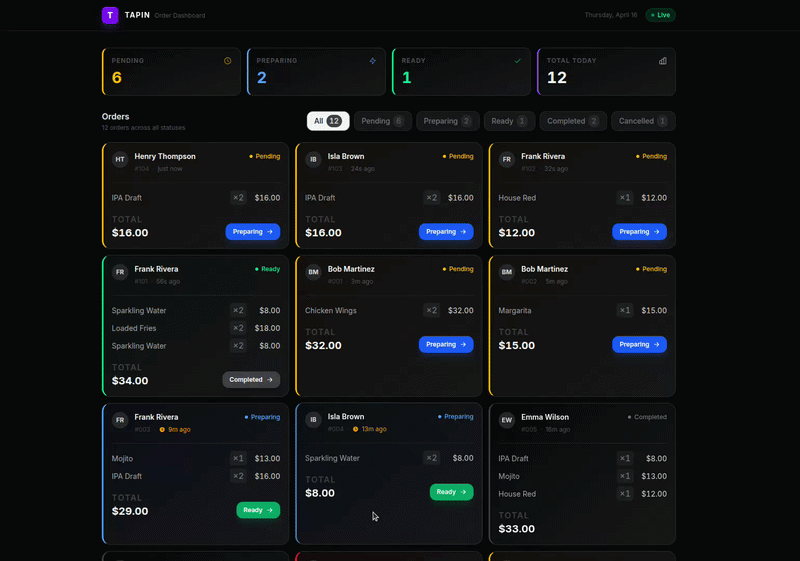

# 🍽️ Tapin — Order Dashboard

> A real-time order management dashboard for venue operators, built with React, TypeScript, and Tailwind CSS v4.



## ✨ Features

- **Real-time Order Updates** — New orders appear automatically without page refresh
- **Optimistic UI Updates** — Instant feedback when advancing order status
- **Smart Status Filtering** — Filter orders by status with live count badges
- **Urgency Indicators** — Visual warnings for orders waiting 8+ minutes
- **Responsive Design** — Works seamlessly on desktop, tablet, and mobile
- **Error Handling** — Automatic rollback when updates fail (15% simulated failure rate)
- **Performance Optimized** — React Query caching, deduplication, and background refetches
- **Dark Mode UI** — Modern dark theme with smooth animations

---

## 🚀 Quick Start

Get up and running in 3 simple steps:

```bash
# 1. Install dependencies
npm install

# 2. Start development server
npm run dev

# 3. Open http://localhost:5173 in your browser
```

---

## 📋 Prerequisites

Before you begin, ensure you have the following installed:

- **Node.js** (v18 or higher) — [Download here](https://nodejs.org/)
- **npm** (v9 or higher) — Comes with Node.js
- **Git** — [Download here](https://git-scm.com/)

Check your versions:
```bash
node --version  # Should be v18+
npm --version   # Should be v9+
```

---

## 🛠️ Installation Guide

### Step 1: Clone the Repository

```bash
git clone <your-repo-url>
cd tapin-order-dashboard
```

### Step 2: Install Dependencies

```bash
npm install
```

This will install all required packages including:
- React 19.2.4
- TypeScript 6.0.2
- Tailwind CSS v4.0.0
- TanStack Query 5.99.0
- Vite 8.0.4

### Step 3: Run the Development Server

```bash
npm run dev
```

The app will be available at **http://localhost:5173**

---

## 📦 Available Scripts

| Command | Description |
|---------|-------------|
| `npm run dev` | Start development server with hot reload |
| `npm run build` | Build for production (outputs to `dist/`) |
| `npm run preview` | Preview production build locally |
| `npm run lint` | Run ESLint to check code quality |

---

## 🏗️ Building for Production

Create a production-ready build:

```bash
npm run build
```

The optimized files will be in the `dist/` folder. You can preview the build:

```bash
npm run preview
```

Deploy the `dist/` folder to any static hosting service:
- Vercel
- Netlify
- AWS S3 + CloudFront
- GitHub Pages

---

## 🎨 Tech Stack

### Core
- **React 19** — Latest React with concurrent features
- **TypeScript 6** — Type-safe development
- **Vite 8** — Lightning-fast build tool with HMR

### Styling
- **Tailwind CSS v4** — Utility-first CSS with new CSS-based configuration
- **@tailwindcss/vite** — Native Vite integration for Tailwind v4
- **Custom Design Tokens** — Semantic theme values extracted to CSS variables

### State Management
- **TanStack Query v5** — Server state management with caching
- **React Hooks** — Local UI state with `useState`

### Development
- **ESLint** — Code linting with React-specific rules
- **TypeScript Strict Mode** — Enhanced type checking

---

## 🎯 Key Concepts

## Approach

### State management

| Concern | Solution |
|---|---|
| Server / async state | TanStack Query (`useQuery`, `useMutation`) |
| UI filter state | `useState` in `OrderDashboard` |
| Global state | None — not needed for this scope |

TanStack Query was chosen over a manual `useEffect` + `useState` approach
because it gives us caching, deduplication, background refetches, and
`cancelQueries` for free — all of which the optimistic update pattern depends on.

### Optimistic updates

`useOrders` implements the standard TanStack Query optimistic pattern:

1. **`onMutate`** — cancel outgoing refetches → snapshot current cache → apply
   the status change immediately so the UI responds without a network round-trip.
2. **`onError`** — restore the snapshot, rolling back the card to its previous
   state. A 15 % artificial failure rate in `ordersApi.ts` lets you see this in
   action — just click "Advance" a few times.
3. **`onSettled`** — always invalidate so the cache reconciles with the server.

### Part 3 — Real-time (Option A)

`useOrdersRealtime` simulates an SSE connection via `setInterval`. In
production the hook body would be replaced with:

```ts
const sse = new EventSource('/api/orders/stream');

sse.addEventListener('order:new', (e) => {
  const order: Order = JSON.parse(e.data);
  queryClient.setQueriesData<OrdersResponse>(
    { queryKey: ['orders'] },
    (old) => old ? { ...old, orders: [order, ...old.orders], total: old.total + 1 } : old,
  );
});

sse.addEventListener('order:updated', (e) => {
  const updated: Order = JSON.parse(e.data);
  queryClient.setQueriesData<OrdersResponse>(
    { queryKey: ['orders'] },
    (old) => old
      ? { ...old, orders: old.orders.map((o) => (o.id === updated.id ? updated : o)) }
      : old,
  );
});

return () => sse.close();
```

The push handler writes directly into the React Query cache, so every
subscribed component re-renders without a network round-trip for the client.

---

## Tradeoffs

- **No pagination UI** — the API layer supports `page`, but the dashboard
  shows the first page only. With more time I'd add an infinite-scroll or
  numbered paginator.
- **Mock failure rate** — `FAILURE_RATE = 0.15` in `ordersApi.ts` is on by
  default to demonstrate rollback. Set it to `0` to remove random failures.
- **Single mutation slot** — one `useMutation` instance means clicking a
  second card while the first is in-flight will show the loading state on the
  second card only (the first finishes in the background). A `Map<id, status>`
  approach would handle concurrent mutations more precisely.
- **No toast library** — errors surface as an inline banner above the grid.
  In production I'd use `sonner` or similar for non-blocking toasts.

## What I'd add with more time

- Pagination or virtual scrolling (`@tanstack/react-virtual`) for 500+ orders
- Vitest + React Testing Library tests for `useOrders` (optimistic flow,
  rollback, empty/error states)
- A real SSE endpoint (Node/Express) replacing the polling simulation
- WebSocket fallback detection
- Keyboard-accessible status advancement
- `React.lazy` + route-level code splitting for a multi-page app

---

## 🎨 Tailwind CSS v4 Migration

This project uses **Tailwind CSS v4**, which introduced significant changes from v3:

### What Changed

1. **CSS-based Configuration** — No more `tailwind.config.js` JavaScript file
   - Configuration now lives in `src/index.css` using `@theme` directive
   - Theme values are CSS custom properties

2. **Vite Plugin** — Uses `@tailwindcss/vite` instead of PostCSS
   - Removed `postcss.config.js` and `autoprefixer`
   - Faster builds with native Vite integration

3. **Arbitrary Values Extraction** — All square bracket notation moved to theme
   - `text-[10px]` → `text-badge`
   - `text-[11px]` → `text-logo`
   - `border-l-[3px]` → `border-l-accent`
   - Custom opacity values: `3%`, `6%`, `7%`, `8%`

### Theme Configuration

All design tokens are defined in `src/index.css`:

```css
@theme {
  /* Font Sizes */
  --font-size-badge: 10px;
  --font-size-logo: 11px;
  
  /* Border Widths */
  --border-width-accent: 3px;
  
  /* Custom Opacities */
  --opacity-3: 0.03;
  --opacity-6: 0.06;
  --opacity-7: 0.07;
  --opacity-8: 0.08;
  
  /* Shadows & Animations */
  --shadow-card: 0 1px 2px rgba(0,0,0,0.4), 0 0 0 1px rgba(255,255,255,0.04);
  --shadow-card-hover: 0 8px 24px rgba(0,0,0,0.4), 0 0 0 1px rgba(255,255,255,0.06);
  --animate-fade-in: fade-in 0.2s ease-out;
}
```

### Benefits

- **Better IDE Support** — CSS variables provide better autocomplete
- **Native Browser Integration** — No build step needed for CSS variables
- **Type-safe Theme** — Semantic names instead of magic numbers
- **Easier Maintenance** — Update once, apply everywhere

---

## 👨‍💻 Development Workflow

### Making Changes

1. **Run dev server** with hot reload:
   ```bash
   npm run dev
   ```

2. **Edit components** in `src/features/orders/components/`
   - Changes appear instantly thanks to Vite HMR

3. **Check for errors**:
   ```bash
   npm run lint
   npm run build  # TypeScript type checking
   ```

### Working with Mock Data

The app uses in-memory mock data (`src/lib/mockData.ts`). To modify:

- **Change failure rate**: Edit `FAILURE_RATE` in `src/features/orders/services/ordersApi.ts`
- **Add menu items**: Update `MENU_ITEMS` array in `src/lib/mockData.ts`
- **Adjust timing**: Modify `LATENCY_MS` for API delay simulation

### Adding New Orders Statuses

1. Update `OrderStatus` type in `src/features/orders/types.ts`
2. Add mapping in `STATUS_LABELS`, `STATUS_BORDER`, `STATUS_GLOW`
3. Update `STATUS_FLOW` if status should be advanceable
4. Add filter button config in `StatusFilter.tsx`

---

## 🐛 Troubleshooting

### Port Already in Use

If port 5173 is occupied:
```bash
# Kill the process using the port
kill -9 $(lsof -ti:5173)

# Or specify a different port
npm run dev -- --port 3000
```

### Build Errors

If you encounter build errors after pulling changes:

```bash
# Clear cache and reinstall
rm -rf node_modules package-lock.json dist
npm install
npm run build
```

### Tailwind Styles Not Applying

1. Ensure `src/index.css` is imported in `src/main.tsx`
2. Check that `@import "tailwindcss"` is at the top of `index.css`
3. Verify `@tailwindcss/vite` plugin is in `vite.config.ts`
4. Restart dev server

### TypeScript Errors

Check your Node.js version:
```bash
node --version  # Should be v18+
```

Update TypeScript if needed:
```bash
npm install -D typescript@latest
```

---

## 🤝 Contributing

Contributions are welcome! Here's how to get started:

1. **Fork the repository**
2. **Create a feature branch**: `git checkout -b feature/amazing-feature`
3. **Make your changes** and test thoroughly
4. **Commit your changes**: `git commit -m 'feat: add amazing feature'`
5. **Push to the branch**: `git push origin feature/amazing-feature`
6. **Open a Pull Request**

### Commit Convention

We follow [Conventional Commits](https://www.conventionalcommits.org/):

- `feat:` — New feature
- `fix:` — Bug fix
- `refactor:` — Code refactoring
- `docs:` — Documentation changes
- `style:` — Formatting, missing semicolons, etc.
- `test:` — Adding tests
- `chore:` — Maintenance tasks

---

## 📄 License

This project is open source and available under the [MIT License](LICENSE).

---

## 🙏 Acknowledgments

Built with:
- [React](https://react.dev/)
- [TypeScript](https://www.typescriptlang.org/)
- [Tailwind CSS](https://tailwindcss.com/)
- [TanStack Query](https://tanstack.com/query)
- [Vite](https://vitejs.dev/)
- [date-fns](https://date-fns.org/)

---

## 📬 Support

If you have any questions or run into issues:

1. Check the [Troubleshooting](#-troubleshooting) section
2. Search existing issues on GitHub
3. Open a new issue with a detailed description

---

**Happy coding! 🚀**
